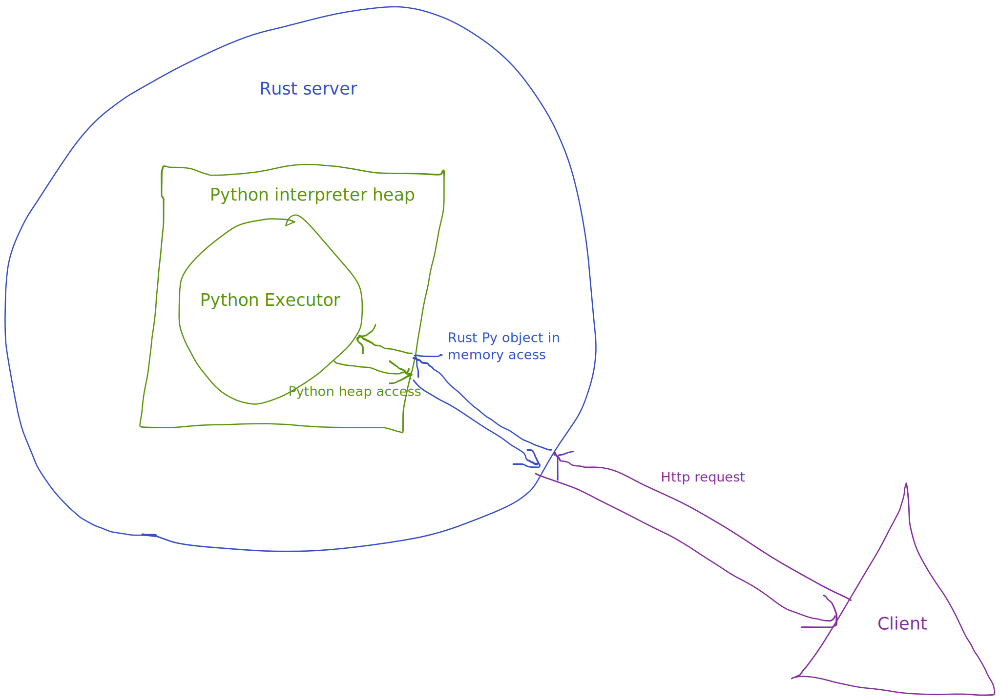

# Serving python code from a rust server:

This project is a proof of concept of a Rust server serving Python code.

This POC is mainly motivated by the following idea: you might have some python code, let's say a deep learning model written with pytorch, that
you want to serve in a production environment, and you want to handle the serving of the model in a rust server.

Why would anyone want to do this ? Maybe you don't want to rewrite the deep learning part in rust, but you would prefer handling all the 
serving and networking in rust because you want to leverage rust advantage over python mainly faster and safer.



## POC

The Goal of this project is to have a Python Class that can be instantiated in a rust server and each call to a route of the server will call
under the hood a method of the Class.

This project use two rust crates:
* [pyo3](https://crates.io/crates/pyo3) to bind rust and python code
* [wrap](https://crates.io/crates/warp) to build the http server

To run it just clone this repo and do
```shell
cargo run
```

then to test it call

```shell
curl localhost:3030
>>> hello web world
```

and you will see on the server log :
```bash
hello rust world
```


You can find the python code under that is serve under the hood by the application under [src/executor/executor/__init__.py](src/executor/executor/__init__.py)


## Brief explanation of how it is working

First Rust starts the python interpreter and initializes the Python Class. The python interpreter stay alive in the background, 
and we have access, from rust, to a `Py<PyAny>` reference to Python Class . This reference is rust smart pointer but under the hood it is just a 
memory reference to the CPython struct of the Python Class allocated on the python heap.

Then rust will start the http server. When the rust server receives a request it will access the 
Python Class hold by the `Py<PyAny>` reference and call the Python method `foo` define in the Python class. It will grab the output and return in to the client.

One thing to keep in mind though is that each time rust access the Pyton Class it needs to acquire the Python [GIL](https://realpython.com/python-gil/) (Global Interpreter Lock). 
It is a requirement to avoid any concurrency issue with Python thread. It means that you will still be CPU bounded when using thread that call python code. But this is a Python
issue. It might disappear at some point, some people are working on removing the [GIL from python](https://github.com/colesbury/nogil)


